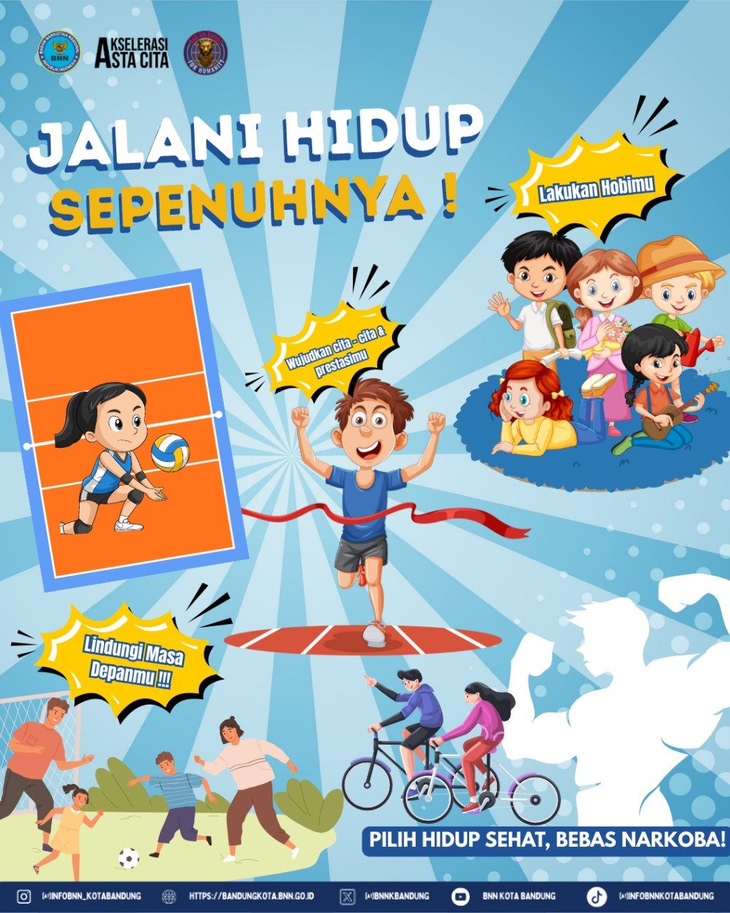

# 📌 Panduan Pengelolaan Poster BNNK Bandung

Dokumen ini berisi panduan lengkap untuk mengelola poster yang digunakan pada halaman **Bank Poster** dan **modal preview** website BNNK Bandung.

## 📂 Struktur Folder

Pastikan struktur folder tetap konsisten seperti berikut:

```
assets/
├── poster.css           # Styling untuk halaman poster
├── poster.js            # Script interaksi modal
├── jalani_hidup.jpg     # Contoh file poster
├── manusia_sehat.png    # Contoh file poster
└── ...                  # File poster lainnya
```

## 🖼️ Menambahkan Poster Baru

### Langkah-langkah:

1. **Persiapan File**
   - Simpan file gambar baru ke folder `assets/`
   - Format yang disarankan: **.jpg** atau **.png**
   - Gunakan nama file yang deskriptif tanpa spasi
   
   **Contoh penamaan yang baik:**
   ```
   ✅ hidup_sehat.jpg
   ✅ poster-antinarkoba.png
   ✅ kampanye_2024.jpg
   
   ❌ Poster Baru.jpg
   ❌ gambar 1.png
   ```

2. **Edit File HTML**
   - Buka file `poster.html`
   - Tambahkan card baru di section yang sesuai (`Poster Edukasi` atau `Poster Kampanye`)

   ```html
   <div class="poster-card">
     <a href="assets/hidup_sehat.jpg" class="poster-link">
       
       <div class="poster-info">
         <span class="category">Edukasi</span>
         <h3>Hidup Sehat Tanpa Narkoba</h3>
       </div>
     </a>
   </div>
   ```

3. **Verifikasi**
   - Simpan file dan refresh browser
   - Pastikan poster muncul dengan benar
   - Test modal preview dengan mengklik poster

## 🔄 Mengganti Gambar Poster

### Cara mengganti poster yang sudah ada:

1. **Identifikasi elemen yang akan diganti**
   
   Cari kode seperti ini di `poster.html`:
   ```html
   <a href="assets/jalani_hidup.jpg" class="poster-link">
     
   </a>
   ```

2. **Update referensi file**
   
   Ganti kedua atribut `src` dan `href` dengan file baru:
   ```html
   <a href="assets/poster_baru.jpg" class="poster-link">
     
   </a>
   ```

3. **Pastikan file tersedia**
   - Verifikasi file gambar sudah ada di folder `assets/`
   - Test tampilan di browser

## 🖼️ Modal Preview

Modal preview bekerja secara otomatis dengan mengambil gambar dari atribut `href` pada link `<a>`.

**Tidak perlu mengedit JavaScript** jika hanya mengganti file gambar. Cukup pastikan:
- Atribut `href` menunjuk ke file yang benar
- File gambar tersedia di folder `assets/`

**Contoh:**
```html
<a href="assets/poster_keren.jpg" class="poster-link">
  
</a>
```

## 🎨 Kustomisasi Styling

Semua styling poster diatur dalam file `assets/poster.css`.

### Class utama yang dapat dikustomisasi:
- `.poster-card` - Styling individual poster
- `.poster-grid` - Layout grid poster
- `.poster-info` - Informasi overlay poster
- `.modal` - Styling modal preview

## 📋 Checklist Quality Control

Sebelum publish, pastikan:

- [ ] File gambar sudah dikompres untuk loading yang cepat
- [ ] Nama file menggunakan format yang konsisten
- [ ] Alt text deskriptif untuk accessibility
- [ ] Modal preview berfungsi dengan baik
- [ ] Responsif di berbagai ukuran layar
- [ ] Kategori poster sudah sesuai (`Edukasi` atau `Kampanye`)

## ⚠️ Hal Penting yang Perlu Diperhatikan

### Penamaan File
```bash
# ❌ Hindari
"Poster Baru.jpg"           # Ada spasi
"poster#1.jpg"              # Karakter khusus
"POSTER-BARU.JPG"           # Huruf kapital semua

# ✅ Gunakan
"poster_baru.jpg"           # Underscore
"poster-antinarkoba.png"    # Dash
"edukasi_remaja_2024.jpg"   # Deskriptif
```

### Optimasi Gambar
- Ukuran file maksimal: **2MB** per gambar
- Resolusi yang disarankan: **1920x1080px** atau **1080x1350px**
- Kompres gambar sebelum upload untuk performa yang lebih baik

### File yang Tidak Boleh Dihapus
- `assets/poster.js` - Mengatur modal preview dan tombol download
- `assets/poster.css` - Styling utama halaman
- File HTML utama yang berisi struktur halaman

## 🔧 Troubleshooting

### Poster tidak muncul?
1. Periksa path file di atribut `src` dan `href`
2. Pastikan file ada di folder `assets/`
3. Periksa konsol browser untuk error

### Modal tidak berfungsi?
1. Pastikan file `poster.js` tidak terhapus
2. Periksa atribut `class="poster-link"` pada tag `<a>`
3. Refresh browser dan clear cache

### Tampilan tidak responsif?
1. Periksa file `poster.css` tidak corrupt
2. Pastikan viewport meta tag ada di HTML
3. Test di berbagai ukuran browser

---

**💻 Developer:** BangSa Tech Dev  
**📅 Last Update:** 2024  
**📧 Support:** [wa.me/6285798162625](https://wa.me/6285798162625)
  

---

> **💡 Tip:** Selalu backup file sebelum melakukan perubahan besar dan test di environment development terlebih dahulu.
